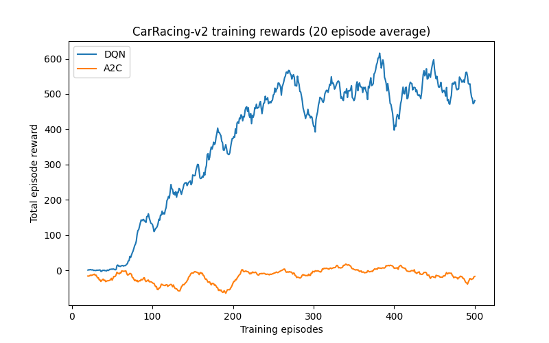

# Deep Reinforcement Learning for Racing Games


Advantage Actor-Critic (A2C) and Deep Q-Network (DQN) implementations for MountainCar-v0 and CarRacing-v2 using TensorFlow 2, accompanied by an undergraduate thesis.

## Getting Started

> **NOTE: pywin32 is used for the GUI.**
>
> **To run on a non-Windows machine, remove lines 8-22 (inclusive) from `code/utils.py`; this will remove window closing functionality for the gameplay visualization.**

1. Clone the repository

    ```
    git clone https://github.com/ary4n99/undergrad-project.git
    cd undergrad-project
    ```

2. Install `python3.7`

    *Recommended: create a new conda environment*

    ```
    conda create -n env_name python=3.7
    conda activate env_name
    ```

3. Install the required dependencies

    ```
    cd code
    pip install -r requirements.txt
    ```

4. Run the GUI

    ```
    python gui.py
    ```

## Results

|   |  Mountain Car | Car Racing |
|---|---|---|
| Advantage Actor-Critic (A2C) |  |  |
| Deep Q-Network (DQN) |  |  |

## Training Rewards

|  Mountain Car | Car Racing |
|---|---|
| |  |
